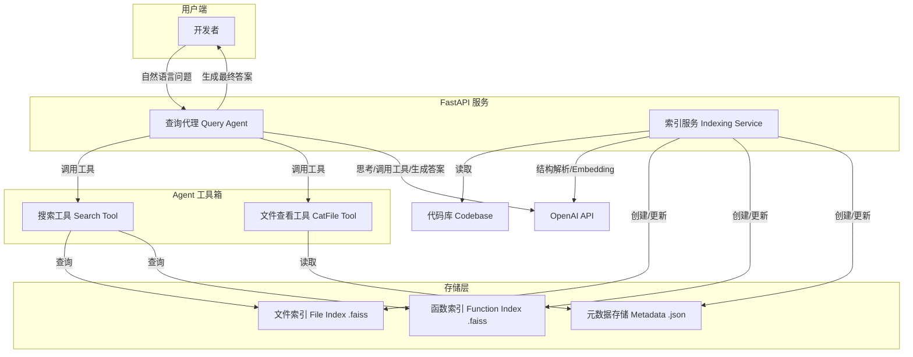

# 设计文档 (PRD + RFC): Agentic 结构感知代码索引系统

**版本**: 0.1  
**日期**: 2025-11-07  
**作者**: AI Research Assistant

## 1. 设计目标 (Design Goals)

本次设计的核心目标是构建一个智能代码索引与查询系统。该系统不仅仅是一个简单的代码搜索引擎，而是一个能够让开发者通过自然语言与代码库进行深度对话的"代码伴侣"。

最终交付的系统应达成以下目标：

- **深度理解代码**: 系统能够区分代码的宏观结构（文件级别）与微观实现（函数级别），并基于此提供不同粒度的上下文。
- **直观的自然语言交互**: 开发者可以通过提问的方式，如"项目中处理用户认证的逻辑在哪里？"或"给我看看 UserService 这个类里所有关于权限校验的函数"，来探索和理解代码。
- **Agentic 探索式查询**: 系统应支持由 LLM Agent 驱动的多轮、迭代式查询。Agent 能够根据初步结果自主地调整和深化查询，模拟人类专家的思考和探索过程，最终给出综合性的答案。
- **可靠与可扩展**: 系统核心功能应通过 API 提供服务，并保证输出结果的结构化和可靠性，为未来集成到 IDE 插件、CI/CD 流程等更广泛的开发工具链中奠定基础。

## 2. 关键设计原则 (Key Design Principles)

为实现上述目标，我们确立了以下三大设计原则：

### 结构感知是核心 (Structure-Awareness is Paramount)

我们认为代码不是扁平的文本。索引和查询必须尊重并利用代码的内在层次结构。因此，系统设计的基石是将代码库解构为文件和函数两个核心层级，并为它们分别建立索引。这使得 Agent 可以根据任务需求，在"浏览森林"（文件级别）和"观察树木"（函数级别）之间自如切换。

### 代理驱动的交互式搜索 (Agent-Driven Interactive Search)

高质量的答案往往源于一系列的探索而非单次搜索。本系统将查询过程交由一个 LLM Agent 主导。Agent 拥有查询不同粒度索引和查看文件原始内容的工具，它可以通过多轮的"思考-行动"循环（Thought-Action Loop）来分解复杂问题、验证假设、并整合信息，从而提供比传统检索更具洞察力的答案。

### 务实的简洁性 (Pragmatic Simplicity)

在技术选型上，我们优先选择成熟、轻量且易于部署的方案。使用 FastAPI 构建接口、FAISS IndexFlatL2 作为本地向量索引库，以及 Pydantic 进行数据校验，旨在构建一个自包含、依赖少、性能可靠的核心系统，避免过早引入复杂的分布式基础设施。

## 3. 关键技术决策 (Key Technical Decisions)

基于上述原则和前期调研，我们做出以下关键技术决策：

### 数据模型与索引策略: 双层索引结构

**决策**: 我们将为代码库创建两个独立的索引：文件索引 (File Index) 和 函数索引 (Function Index)。

**理由**: 这种分离式设计赋予了查询 Agent 控制信息粒度的能力。对于"这个项目是做什么的？"这类高阶问题，Agent 可以优先查询文件索引获取全局上下文。对于"calculate_discount 函数的具体实现"这类精确问题，则可以直接查询函数索引。

### 代码结构解析: LLM 驱动的边界识别

**决策**: 在索引阶段，我们将以文件为单位，调用 LLM (如 gpt-5-mini) 来识别并输出该文件中所有函数的名称、起始行和结束行。

**理由**: 这遵循了本次设计的具体构想。相较于使用 Tree-sitter 等确定性解析器，这种方法的优势在于其灵活性，理论上可以处理语法不完整或非标准的代码片段。但需要注意其成本和稳定性，在未来版本中可以评估替换为 Tree-sitter 的可能性。

#### 权衡分析 (Trade-off Analysis)

**选择 LLM 解析的优势**:

1. **开发速度快**: 无需为每种编程语言单独实现 AST 解析器，可以快速支持多种语言
2. **灵活性强**: 能够处理语法不完整、非标准或混合语言的代码片段，对代码格式的容错性更高
3. **统一接口**: 所有语言使用相同的 LLM 接口，代码结构更简洁，维护成本更低

**选择 LLM 解析的劣势**:

1. **运行时性能**: 相比本地 AST 解析器，LLM API 调用存在网络延迟，处理速度较慢
2. **成本问题**: 每次索引都需要调用 LLM API，对于大型代码库会产生较高的 API 调用成本
3. **稳定性**: LLM 输出可能存在不一致性，需要额外的验证和错误处理机制

**替代方案与适用场景**:

- **使用 Self-hosted LLM**: 如果你有自部署的快速 LLM（如本地部署的 Ollama、vLLM 等），可以显著降低成本和延迟，同时保留 LLM 解析的灵活性优势
- **使用抽象 AST Parser**: 如果你确定只支持少数几种语言（如 Python、JavaScript、TypeScript），且有精力进行适配，可以设计一个抽象的 AST 解析接口，为每种语言实现对应的解析器（如使用 Tree-sitter）。这种方式在运行时性能更好、成本更低，但需要更多的开发和维护工作

**设计建议**: 系统架构应该支持可插拔的解析器接口，允许用户根据自身需求选择 LLM 解析或 AST 解析。对于追求快速开发和多语言支持的场景，推荐使用 LLM 解析；对于性能敏感或成本敏感的场景，推荐使用 AST 解析。

### 向量搜索引擎: FAISS IndexFlatL2

**决策**: 使用 FAISS 库的 IndexFlatL2 作为向量索引。这是一个进行穷举式、精确L2距离计算的索引 [source]。

**理由**: 对于中小型代码库，IndexFlatL2 提供了100%的召回率，保证了搜索结果的准确性。同时，它实现简单，无需训练，并且可以轻松地与索引数据一同序列化到单个文件中，符合我们"务实的简洁性"原则。当未来面临超大规模代码库时，可以平滑过渡到如 IndexIVFPQ 等更高效的近似最近邻（ANN）索引 [source]。

### Embedding 模型: OpenAI text-embedding-3-small

**决策**: 选用 OpenAI 的 text-embedding-3-small 模型进行向量化。

**理由**: 该模型在性能和成本之间取得了出色的平衡，是当前市场上的主流选择之一，非常适合用于代码和自然语言的语义表示。

### API 框架: FastAPI

**决策**: 使用 FastAPI 构建后端服务。

**理由**: FastAPI 具备高性能、异步支持、与 Pydantic 的原生集成以及自动生成API文档等优点，是构建此类 AI 服务接口的理想选择 [source]。

### 输出可靠性: Pydantic + OpenAI Schema Enforcement

**决策**: Agent 的最终输出必须遵循预定义的 Pydantic Schema。我们将利用 OpenAI API 最新的"结构化输出"功能来强制执行此 Schema。

**理由**: OpenAI 的新版 API (如 gpt-5-mini) 支持在请求中提供 JSON Schema，并能以极高的可靠性保证输出格式的完全一致 [source]。通过将 Pydantic 模型直接转换为 JSON Schema，我们可以确保 Agent 的最终回答是可预测、可解析和类型安全的，杜绝了不稳定的输出格式。

## 4. 系统架构与模块 (System Architecture & Modules)

### 4.1 整体架构

系统由一个通过 FastAPI 暴露的后端服务构成，主要包含两大核心模块：索引服务和查询代理。



### 4.2 模块一: 索引服务 (Indexing Service)

该服务负责对指定的代码库进行解析、向量化和索引的构建。

**Endpoint**: `POST /index`

**Request Body**:
```json
{
  "codebase_path": "/path/to/your/project"
}
```

**核心流程**:

1. **遍历文件**: 服务接收到路径后，递归遍历所有支持的源文件（如 .py, .js, .go 等）。
2. **结构解析**: 对每个文件，调用 OpenAI API，提供一个带有函数描述指令的 Prompt，要求其返回文件中所有函数的 JSON 列表，包含 `{ "function_name": "...", "start_line": ..., "end_line": ... }`。
3. **数据分块 (Chunking)**: 基于解析结果，创建两种类型的 Chunk 对象。
   - **文件 Chunk**: type 为 file，content 为文件全部内容。
   - **函数 Chunk**: type 为 function，content 为从 start_line 到 end_line 的代码片段。
4. **元数据存储**: 所有 Chunk 的元数据（文件路径、起止行、原始内容等）被结构化地存储在一个 JSON 文件中，以便快速读取。
5. **向量化**: 将所有 Chunk 的 content 批量发送给 OpenAI text-embedding-3-small API，获取对应的 embedding 向量。
6. **构建 FAISS 索引**:
   - 将所有文件 Chunk 的向量添加到一个 `faiss.IndexFlatL2` 实例中，并保存为 `file_index.faiss`。
   - 将所有函数 Chunk 的向量添加到另一个 `faiss.IndexFlatL2` 实例中，并保存为 `function_index.faiss`。

### 4.3 模块二: 查询代理 (Query Agent)

该模块是系统的"大脑"，负责与用户交互，并通过调用工具来解答问题。

#### Agentic 工作流:

1. **初始化**: Agent 启动时，加载一个系统提示 (System Prompt)，该提示会清晰地描述它的角色、可用工具及其使用方法。
2. **接收查询**: 接收用户的自然语言问题。
3. **多轮迭代 (Loop)**:
   - Agent 开始一个上限为 N 轮（例如 N=6）的迭代循环。
   - 在每一轮，Agent 根据当前的对话历史和上下文，决定下一步行动：是直接回答，还是调用工具。
   - 如果决定调用工具，它会生成一个符合工具签名（如 `search(question="...", index_type="function", top_k=5)`）的请求。
4. **工具执行**: 系统解析 Agent 的请求，执行相应的工具函数（search 或 list_file_content），并将工具的输出结果（如搜索到的代码片段）格式化后返回给 Agent。
5. **强制总结**: 当达到第 N 轮时，系统将不再向 Agent 提供工具。此时的 Prompt 会指示 Agent 必须根据已经收集到的所有信息，进行最终的总结和回答。
6. **结构化输出**: Agent 的最终回答被强制要求符合一个预定义的 Pydantic 模型，利用 OpenAI 的 response_format 功能实现 [source]。如果 API 调用因任何原因失败，系统将进行重试。

#### Agent 可用工具定义:

**`search(question: str, index_type: str, top_k: int = 5)`**

- `question`: 用于生成 embedding 的自然语言查询。
- `index_type`: 必须是 'file' 或 'function' 之一，用于选择查询哪个 FAISS 索引。
- `top_k`: 返回最相似的结果数量。
- **返回**: 一个 JSON 字符串，包含 top_k 个结果的列表。每个结果都包含其元数据和完整的代码内容。

**`list_file_content(file_path: str)`**

- `file_path`: 要查看的文件的完整路径。
- **返回**: 包含该文件完整内容的字符串。

#### Agent 系统提示 (System Prompt) 示例片段:

```text
你是一个顶级的软件工程师和代码库专家。你的任务是回答关于一个代码库的问题。
你可以使用以下工具来帮助你探索代码库：

search(question: str, index_type: str, top_k: int = 5):
当你需要根据语义查找相关的代码时使用此工具。
index_type 可以是 'file' 来获取文件级别的概览，或者是 'function' 来查找具体的实现细节。

例如: search(question="用户登录逻辑", index_type="function", top_k=3)

list_file_content(file_path: str):

当你从 search 工具的结果中得知一个重要文件的路径，并想查看它的完整内容时使用。
例如: list_file_content(file_path="src/auth/service.py")

请遵循 "思考 -> 行动 -> 观察 -> 思考..." 的循环来解决问题。你最多有6轮机会来调用工具。在最后一轮，你必须给出最终答案。
```
